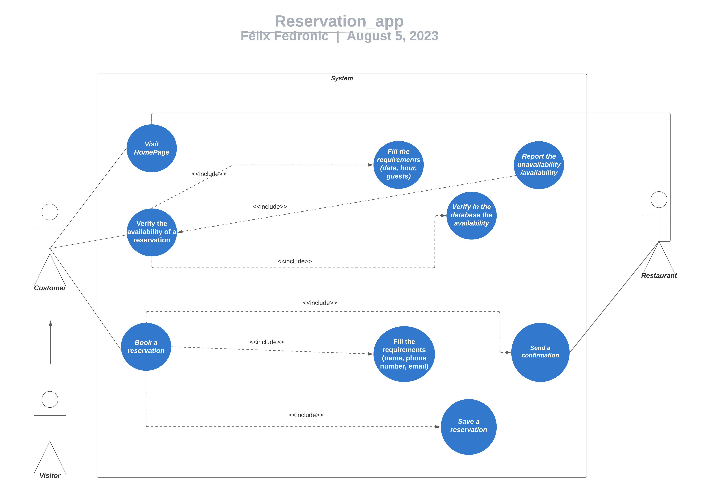
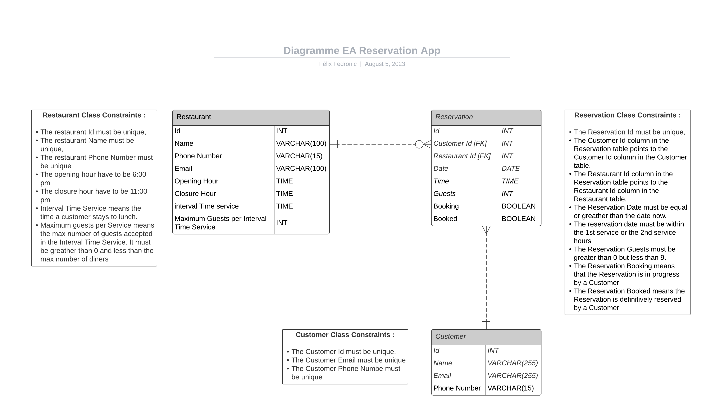

# Use Case Sequences

> Use Case limited to one restaurant service

## **Case Name:** Check a Reservation Availability

**Actor(s):** Client.
**Output Data:** The date, time, and number of participants requested by the client.
**Context:** The case starts when the client arrives on the reservation page.
**Main Scenario:**
1.The system prompts the client to enter the desired date, time, and number of participants for the reservation to check availability.
2.The client enters the desired date, time, and number of participants.
3.The system informs the client of the reservation's availability and asks the client to confirm the reservation.
**Variants, Error Cases:**
*Reservation unavailable for the desired time*
3a. The system informs the client that the requested reservation is not available for the desired time.
3b. The system suggests available times for the desired date and number of participants.
*Reservation impossible for the desired date*
3c. The system informs the client that the requested reservation is not available for the desired date.
3d. The system prompts the client to enter a date, time, and number of participants for another desired date.

## **Case Name:** Validate Reservation

**Actors:** Client, Restaurant Owner
**Input Data:** The date, time, and number of participants requested by the client.
**Output Data:** The complete details reservation.
**Context:** The case starts when the system asks the client to validate the reservation.
**Main Scenario:**
1.The system asks the client to enter a name, a valid French phone number, and a valid email address.
2.The client enters a name, a valid French phone number, and a valid email address.
3.The system notifies the client of the confirmation of their reservation.
3.The system notifies the restaurant owner of the client's reservation.
**Variants, Error Cases:**
*Invalid contact details*
2a. The system notifies the client that the phone number or email is not valid.
2b. The system prompts the client to enter a valid phone number or email address.
2c. The client enters a valid phone number or email address.
*Existing reservation under the client's name with the input data.*
3a. The system notifies the client that a reservation already exists under their name with the given input data.
3b. The system informs the client that they must call the restaurant owner to cancel their reservation.

## Use Case Diagram

## EA Diagram

